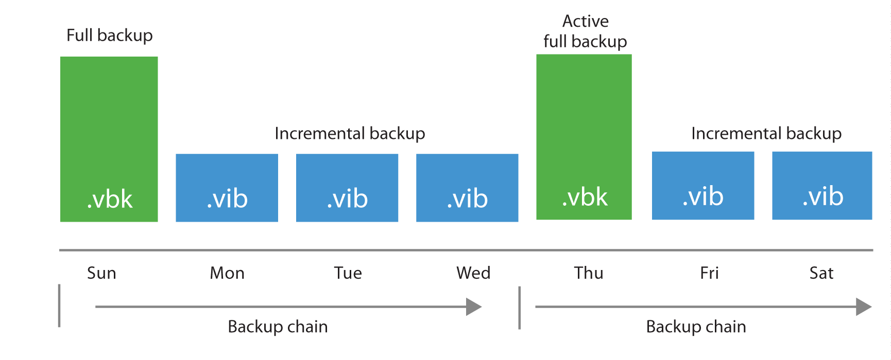
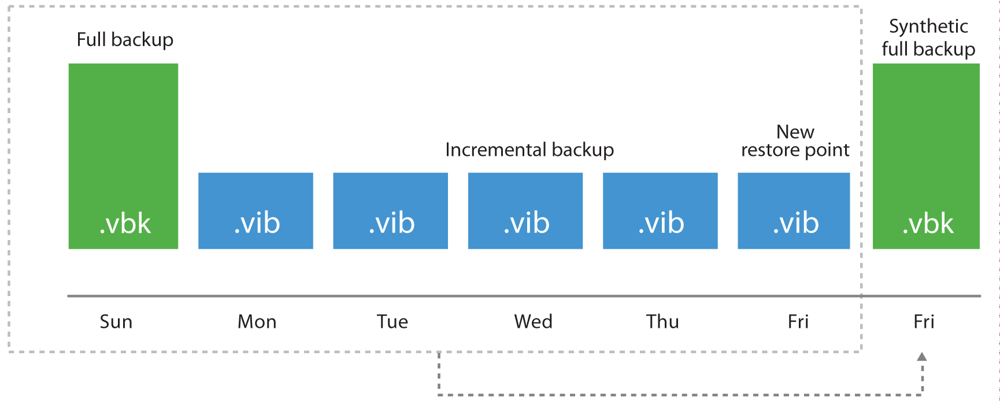
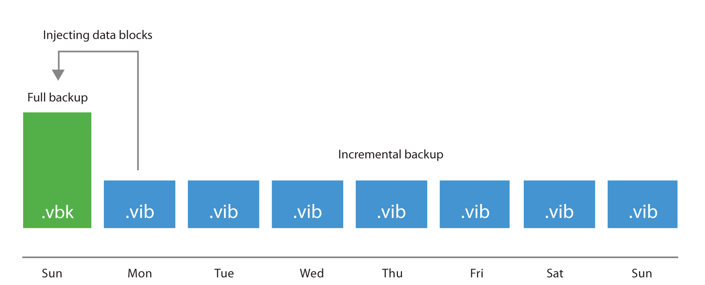

# Backup Methods

Veeam Backup & Replication stores backups on disk using a simple,
self-contained file based approach. However, there are several methods
available for exactly how those files are created and stored on the file
system. This section will provide an overview of these methods, their
pros and cons, as well as recommendations on use cases for each one.

### Forward Incremental

The forward incremental backup method is the simplest and easiest to
understand; it generally works well with all storage devices although it
requires more storage space than other backup methods due to the fact
that it requires the creation of periodic full backups (either using
active or synthetic backups), typically scheduled weekly. This is
necessary because the incremental backups are dependent on the initial
full backup; thus, older backups cannot be removed from retention chain
until a newer backup chain is created. When a new full backup arrives, a
new chain is started, and the old backups can be removed once the new
chain meets the retention requirements.

#### Active Full Backups

The first time a job is run it always performs an active full backup.
During this process the VM is read in full, and VM data is stored
(typically compressed and deduped) into a Veeam’s full backup file
(.VBK).

Each time an active full is performed (either on schedule or by manual
launch of the Active Full command), a new .VBK file is created once
again by reading all data from the source VM. Increments are stored in
Veeam’s incremental backup files (.VIB).

This approach provides for a very reliable backup process, since every
time a full is created, each VM is read in its entirety.

##### **I/O Impact of Active Full**

When creating an active full, the I/O load on the backup storage is
mainly sequential writes, which generally provides good performance for
most storage types. However, all the data (not just the changes) has to
be copied from the production ESX hosts, and this will increase the time
a VM snapshot remains open (see also the “Impact Snapshot Operation”
section of this guide).

##### **Recommendations on Usage**

Forward incremental backup provides good performance with almost any
storage. It can be used in any case where plenty of repository space is
available and the backup window allows enough time to support reading
the source data in full.

  Use                                                                                                                  Don’t Use
  -------------------------------------------------------------------------------------------------------------------- ---------------------------------------------------------------------------------------------------------------------
  Recommended for deduplication appliances that use SMB or NFS protocols.                                              When backup window does not allow enough time for re-reading all of the source VM data.
  On storage systems that use software or non-caching RAID hardware such as many low-end NAS devices.                  For large or performance sensitive VMs where re-reading the data can have a negative impact on the VMs performance.
  Provides highest level of backup chain consistency since each new chain is populated by re-reading VM source data.   

#### Synthetic Fulls

Synthetic fulls take all the data in the previous chain (full .VBK and
incremental .VIB files) and the incremental changes from production
(using CBT if available), and create a new full backup using the
existing data on the backup storage.

If a synthetic full is scheduled, when the job runs, it first creates a
normal incremental backup – to collect the most recent changes.

After the job completes this phase, a synthetic full process is stared.
It reads the most recent version of each block for every VM in the job
from the appropriate backup file and writes those blocks to a new VBK
file. This is how a new full backup is created.

##### I/O Impact of Synthetic Full

Synthetic full creation is an I/O intensive process on the repository.
Since the process reads individual blocks from the various files in the
chain and writes those blocks to the VBK, it creates a roughly 50/50
read/write mix. The processing speed is limited by the IOPS and latency
profile of the repository storage, so it can take significant amount of
time. However, there is no impact on the source storage during this time
as I/O occurrs only in the repository.

##### Recommendations on Usage

Due to the way this synthetic full process works, having many smaller
backups jobs with fewer will perform synthetic full processing faster
than having very large backup jobs with many VMs. Keep this in mind when
setting up jobs that will use this method.

  Use                                                                                                                  Don’t Use
  -------------------------------------------------------------------------------------------------------------------- ---------------------------------------------------------------------
  Recommended for use when repository storage uses fast disk with caching RAID controllers using large stripe sizes.   Small NAS boxes with limited spindles that depend on software RAID.
  Can be used for deduplication appliances that support synthetic offload (currently only Data Domain with DDBoost).   Deduplication appliances that use SMB or NFS protocols.

### Forever Forward Incremental

Forever forward incremental method keeps one full backup file (VBK) on
disk, and then only incremental backups (VIBs) afterwards. This method
allows backups space to be utilized efficiently, as there is only a
single full backup on disk due to a merge process. This process is
launched when the retention setting is met. It takes the oldest
incremental backup and writes those blocks into the VBK, moving the VBK
forward.

#### I/O Impact of Merge Process

The merging process is performed at the end of the backup job once the
retention for the job has been reached. This process will read the
blocks from the oldest incremental backups (VIB file) and write those
blocks into the VBK file thus it creates a 50/50 read-write mix on the
target storage. The time required to perform the merge will be based on
the size of the incremental data and the random I/O performance of the
underlying storage.

#### Recommendations on Usage

The primary advantages of using forever forward incremental backup
method are the space savings and very fast, incremental backups.
However, the tradeoff is the time required for the merge process. This
process can take from minutes to hours depending on the amount of
incremental change that the job has to process. However, this merge
process impacts only the target storage thus the impact on production is
quite low.

Like with synthetic full, it can be recommended to have many smaller
jobs with a limited number of VMs (20-30), which can significantly
increase the performance of synthetic merge process. Very large jobs
with more than100 VMs can experience significant increase in time due to
extra metadata processing.

  Use                                                                                                                  Don’t Use
  -------------------------------------------------------------------------------------------------------------------- ---------------------------------------------------------------------------------------------------------------------------------------------------------------------------------------------
  Recommended for use when repository storage uses fast disk with caching RAID controllers using large stripe sizes.   Small NAS boxes with limited spindles that depend on software RAID.
  Excellent for low change rate VMs, especially large VMs with limited daily change.                                   Deduplication appliances that use SMB or NFS protocols.
                                                                                                                       May not be ideal for VMs that create a large amount of change each day as merge times can be significant although this may still be acceptable if the merge finishes in an acceptable time.

### Reverse Incremental

At its first run, reverse incremental backup creates a full backup file
(VBK). All subsequent backups are incremental, that is, only changed
data blocks are copied (using CBT if available). During the incremental
backup, changed blocks are written directly into the full backup, while
replaced blocks are taken out and copied into Veeam’s rollback file
(.VRB).

This method provides space-efficient backup, as there is only one full
VBK to store. It also facilitates granular retention, since removing old
points is simply a matter of deleting old VRB files.

The disadvantage is that creation of rollbackup files occurs during the
backup process itself, which results in high I/O load on the target
storage and can slow the backup process down. This could be a matter of
concern especially for the VMs that experience high change rates.

#### I/O Impact of Reverse Incremental

During the backup process as changed blocks are read from the source VM
they are written directly to the VBK file. If this block replaces an
existing, older block, that old block is read from the VBK and then
written to the VRB file. This means that reverse incremental backups
create a 66/33 read-write mix on the target storage during the backup
process itself. This I/O typically becomes the limiting factor for
backup performance of the job.

This can be especially noticeable for VMs with a high random change
rate, or when running multiple simultaneous jobs, and is more noticeable
on low-end storage or de-duplication appliances.

#### Recommendations on Usage

  Use                                                                                                              Don’t Use
  ---------------------------------------------------------------------------------------------------------------- ---------------------------------------------------------------------------------------------------------------------------------------------------------------------------------------------
  Can be for used when repository storage uses fast disk with caching RAID controllers using large stripe sizes.   Small NAS boxes with limited spindles that depend on software RAID.
  Excellent for low change rate VMs, especially large VMs with limited daily change.                               Deduplication appliances that use SMB or NFS protocols.
                                                                                                                   May not be ideal for VMs that create a large amount of change each day as merge times can be significant although this may still be acceptable if the merge finishes in an acceptable time.
                                                                                                                   As the rollback is created during the backup process itself, backup throughput can be limited by target storage. This slower performance can lead to VM snapshots open for longer time.
