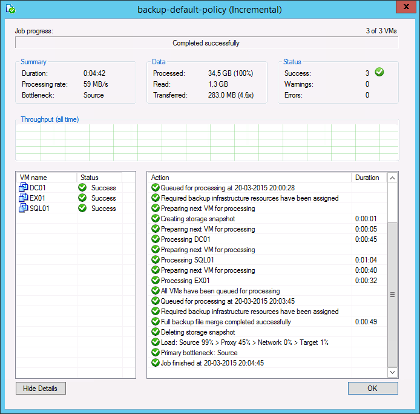
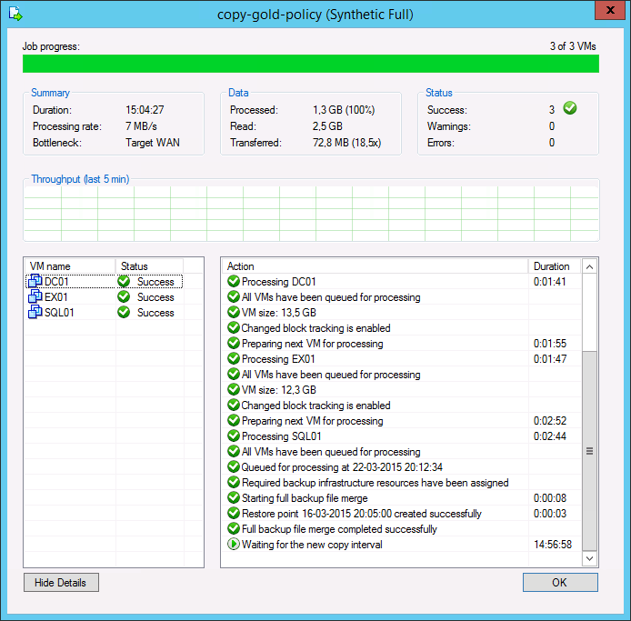

### Analyzing Backup Job
During both full and incremental job sessions, three metrics are displayed in the session data: **Processed**, **Read** and **Transferred**. To better understand the difference between direct data transfer and WAN accelerated mode, examine the **Read** and **Transferred** values: 

 

-   **Read —** amount of data read from the production storage prior to applying any compression and deduplication. This is the amount of data that will be optimized by the WAN accelerator.

-   **Transferred** — amount of data written to the backup repository after applying compression and deduplication. This is the amount of data that will be processed by the backup copy job running in Direct Transfer mode (without WAN acceleration), assuming all VMs from the backup job are included in the backup copy job.

### Analyzing Backup Copy Job
When analyzing a backup copy job you can see the same metrics in the job session Data: **Processed**, **Read** and **Transferred**. Comparing the backup copy job with WAN acceleration enabled and the backup job, it is possible to correlate the information in both outputs.

 

-   The amount of **Processed** blocks in the backup copy job session is equal to the amount of **Read** blocks in the backup job session. This is the most important metric, as it is the amount of data that has to be processed by the WAN accelerator.

-   The number of **Read** blocks for the **backup copy job** is typically higher than the amount of **Processed** - this is due to the backup copy job using a differing fingerprinting algorithm that works with a different block size compared to the fingerprinting algorithm and block size used by **backup jobs** that created the original backup file. For this reason, this metric can be ignored.

-   The amount of **Transferred** data is the amount of data actually transferred over the WAN link. 
