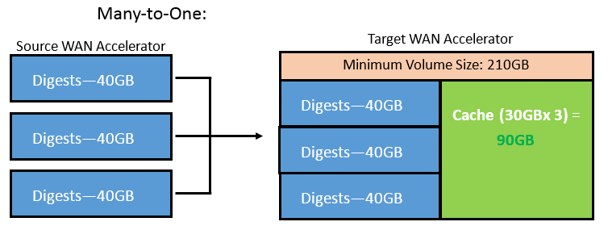

## Sizing Targets for One to One and One to Many relationships

**WAN Accelerator Cache/Digest Provisioning**

we can have two types of relationship wiht our Source and Target accelerators, One to One and many to One.

**One to one is the most simplest form**, this is where on e Source Accelerator is mapped to a single Target Accelerator at the other location.

The other type is **Many to One** where many source accelerators will map to a single target accelerator in a **fan in** type design. this is a common configuration and best practice is to have no more than 4 source accelerators to a single target for resource reasons.

##### Sizing for each scenario:

If we assume that we have 3 VMs, each with unique OSes (for instance, Win 2008R2, Win 2012R2, Solaris 10) each OS requires 10GB to be allocated for it.

The Cache itself is wholly independent from the digests required. That is, the Veeam GUI does not make any determination of how much you can allocate for a digest and so on.

The digest is essentially an indexing of what cached blocks go where. For digest size, 1TB of 
VM disk capacity we are backing up should correspond with 20GB of disk space. That is, for 10VMs we are backing up whose capacity is 2TB, you must account/allocate 40GB for digest data on the Source WAN Accelerator. This limitation is also applied to the Target WAN Accelerator.

For a Many-to-1 setup, the global cache is calculated per 1 Source WAN Accelerator working with the Target WAN Accelerator.

In this case the global cache needs to be increased proportionally.

If we use the same VMs in the previous example, the cache is only required to be 30GB. However, since we’re using 3 Source WAN Accelerators, the cache size must be 90GB in response.  

On the Target WAN Accelerator, not only is the cache size dictated by the amount of Source WAN Accelerators, but so is the Digest on the target end—in this example, we require 120GB of Digest space, which added to the cache size (90GB) results in requiring a 210GB volume size at a minimum.
