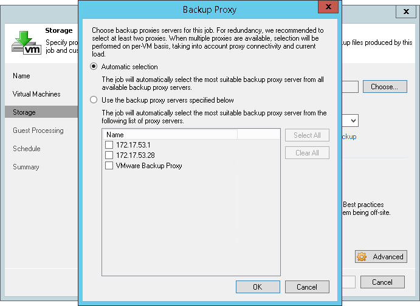

# Network Mode

Network mode is by far the easiest backup mode to implement as it
requires no additional configuration. Veeam always uses this mode at
to back up and restore VMware configuration files and to read
Change Block Tracking information.

When in this mode the backup proxy will connect to ESXi hosts on
VMkernel interfaces by DNS name resolution and use this connection to
transport data utilizing Veeam’s file copy technology (also known as
FastSCP). Remember that the backup proxy requires several ports to be
open, as described in the User Guide:
<https://helpcenter.veeam.com/backup/vsphere/used_ports.html>.

**Note:** It is highly recommended to maintain a good network connection
between the VMware ESXi VMKernel port and Veeam Backup & Replication as
it will be used by many other features like Instant VM Recovery, Virtual
Lab and SureBackup, Linux FLR appliance, config files backups etc.

For load balancing Veeam uses a selection of proxy servers based on the
network subnet:

-   Backup proxies in the same subnets as the VMKernel interfaces (the Interface IP that is bound to the FQDN Name of ESXi hosts) are selected if you have the **Automatic Selection** proxy setting configured in the backup jobs.

> 

-   If proxy servers do not run in same subnets as the VMKernel
    interfaces of the ESXi hosts you will have to manually select the
    proxies that will process your backup jobs, otherwise it is possible
    that proxies from other sites will be used to transport data.
    You can select all proxies from the same site to enable load
    balancing in that case.

> 

-   In case you work with several branches or datacenter environments
    it is also recommended that you manually choose the proxies
    (per site) in the job settings to streamline and speed up the
    load balancing.

## Pros

-   Network mode can be used for both backup and restore with same speed.

-   Can work with both physical and virtual backup proxies.

-   Being the most mature of all transport modes it supports all types
    of storages.

-   Is recommended for use in virtual deployments with NFS-based storage
    systems in cases where Direct NFS is unavailable as it helps to minimize VM stunning. See also the “Considerations for NFS Datastores“ section of this guide.

-   Performance on 10 Gb Ethernet is highly positive specifically as
	the load is spread across all ESXi hosts.

-   As data transfers initiate very quickly the Network mode is
    preferable for processing incremental backups on relatively static
    servers (that is VMs with small amount of changes).

-   It can be helpful when you have plenty of clusters with individual
    storage configurations (e.g., at hosting providers). In such
    deployments using the Network mode for data transfer can help to
    reduce Veeam footprint and costs as well as to increase the
    security (if compared to other modes and storage configuration).

## Cons

-   Typically, Network mode uses only ~40% of the physical available
    bandwidth of the external VMKernel Interface connection due to
    throttling mechanisms implemented on the management interfaces of
    VMware vSphere 4.x-6.x. Sometime less.

-   It can be rather slow on 1 Gb Ethernet (about 10-20 MB/s) due to
    throttling mechanisms so restores via the Network mode can take
    quite a long time with 1GbE.

**Tip:** You can influence the usage of the specific VMKernel interface
by modifying the DNS name resolution for the ESXi hosts on the Backup
& Replication Sever and on all Proxy Servers, for example, by adding
entries in the *hosts* file of the Windows OS or by using special DNS
configuration. See section on DNS at the start of this documented.

## Recommendations

When you choose the network mode not having to deal with hot-add
vCenter and ESXi overhead or physical SAN configurations. The network
mode (NBD) is a very reliable way to do backups. In emergency
situations when you need fast restore the following tips can be helpful:

-   Consider setting up at least one virtual backup proxy
    for hot-add based restores then it will be possible to achieve
    higher throughput and thus lower RTO.

-   You can also restore to a thin disk format and later use standard
    VMware methods to change the disk format to thick disk if needed.
	  Thin disk restores have to transport less data.

-   Another way to overcome this limitation is to use Instant VM
    Recovery with Storage vMotion (if licensed on the VMware
    vSphere side) as it is not affected by any throughput limitations of VMware.

General recommendations:

-   As there is no overhead (like SCSI disk Hot-Add, or search for the
    right volumes in Direct SAN) on backup proxies the Network mode can
    be recommended for scenarios with high-frequency backups or
    replication jobs, as well for environments with very low overall
    data and change rate (VDI).

- 	To protect VMware, Veeam reduces the amount of Network Mode data transport connections to 7. You can add a registry key to Veeam to increase that
	number.

  **ViHostConcurrentNfcConnections = 7 (or higher) (DWORD)**

  in the

  **
    HKLM\\SOFTWARE\\Veeam\\Veeam Backup and** **Replication** registry key.

  More data connections uses more RAM buffers and the default
	reserved RAM on ESXi hosts can produce failed jobs. Consider increasing
	NFC RAM buffer sizes on the ESXi hosts if you increase the above registry
    setting for example from 16384 to 32768 MB.
	http://kb.vmware.com/kb/2052302
    After increasing NFC buffer setting, you can increase the following Veeam Registry setting to add addition Veeam NBD connections:
  **HKLM\SOFTWARE\VeeaM\Veeam Backup and Replication
    ViHostConcurrentNfcConnections**

  DWORD (decimal)
  Default: 7

 Be careful with this setting. If the buffer vs NFC Connection ratio is
	too aggressive, Jobs may fail.

<!-- AN2016 21.06.2016 -->
