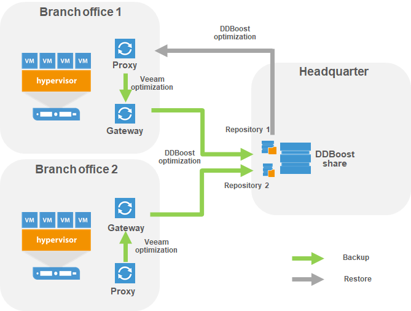
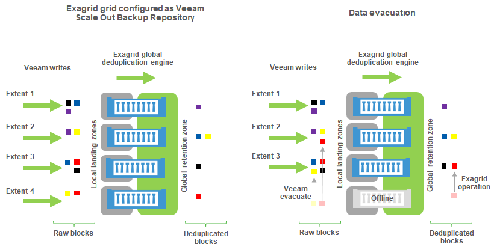

# Deduplication integration specifics

## EMC DataDomain

Selecting DataDomain as a repository will automatically recommend job and repository settings according to best practices. For more information, refer to vendor guidelines.

DDBoost allows for the following capabilities:

-   Source side deduplication between the Veeam gateway server and DataDomain appliance. This will reduce the amount of data sent over the network to the appliance
-   Better LAN parallelization, since DDBoost manages its own network load balancing algorithms which are considered more efficient than standard network links aggregation
-   Seamless Veeam files transformations like synthetic full or forever forward incremental
-   DDBoost can be used through Fibre Channel SAN, providing a totally LAN-free backup solution

For more details, refer to the DDBoost configuration guide by Rick Vanover:  [Best Practices for EMC VNX/VNXe and Data Domain with Veeam Availability Suite](https://www.veeam.com/wp-emc-vnx-vnxe-data-domain-best-practices-with-veeam.html).

### DDBoost over WAN backup copy jobs and Remote Office/Branch Office configuration

When leveraging Backup copy jobs and DDBoost over a WAN network, specific attention should be paid to the mount server localisation to optimize the network traffic at its best.

As specified in the user's guide, DDBoost API is is leveraged on the gateway server when it is explicitely defined in the repository properties.
-	Since it is sending deduplicated data to the DDBoost share the gateway server must reside as close as possible to the source data.
-	The gateway server beeing part of the repository properties, one DDBoost repository shall be created per remote site.
-	To limit the number of objects created on the DataDomain, it is possible to create many Veeam DDBoost repositories pointing to a single DDBoost share, changing only the name and gateway server. For such configuration the number of parallel tasks allowed on each repository must be considered globally. It is recomended to set it to a small amount at first sight to avoid overflowing the common DDBoost share. 
-	During restore process, the rehydration is performed on the proxy used by the restore job. It is advised to manually select a proxy residing as close as possible to the restored guest host during the restore task configuration.

### Chain Length Limitation

Consider that DataDomain can support only up to 60 incremental restore points for a single full backup. For details, refer to the Veeam Backup & Replication User Guide: [Limitations for EMC Data Domain](https://helpcenter.veeam.com/docs/backup/vsphere/emc_dd.html?ver=95)

### Configuring DDBoost over FC device set

When configuring datadomain over FC, it must be decided how many DFC devices should be advertised to the repository gateway.

Andrea Borella posted an interesting article on [why and how to configure DDBoost for FC connection]( https://blog.andreaborella.com/2017/02/configuring-emc-datadomain-boost-fc-with-veeam-br/) based on an EMC publication [EMC® Data Domain Boost for
Partner Integration](https://www.emc.com/collateral/TechnicalDocument/docu85192.pdf) which is summarized below.

**Qdepth limitation**

The Data Domain system imposes a limit of 64 simultaneous requests to a single DFC SCSI device (qdepth). Because of this limit, the number of devices advertised needs to be tuned depending on the maximum number of simultaneous jobs to the system at any given time. Knowing Microsoft Windows is qdepth constrained to one SCSI request at a time through each of its generic SCSI device, the number of devices to advertise on the DataDomain side can be calculated using the following rules:

- **D=max(X,Y))** where
	- D is the number of devices to advertise on the DataDomain
	- X is the Number of DFC needed on the DataDomain to stand the parallelisation
	- Y is the requested number of SCSI targets on the Gateway server to respect the parallel tasks number as configured.

**On the DataDomain side: X calculation**

- Let J be the maximum number of simultaneous jobs running using DFC to the DataDomain system at any given time.
- Let C be the maximum number of connections per job:
	- 3 for Data Domain Extended Retention Systems
	- 1 for other types Data Domain systems
- Maximum simultaneous connections to the DD system:
	- **S = JxC**
	- DFC Device Count **X=roundup(min(64, 2x(S/128)))**
	- All DFC access groups must be configured with “X” devices.
- Let's assume the gateway/repository is configured for
	- 60 parallel tasks
	- Only one gateway will access the DataDomain MTree
	- **S=60x1=60**
	- **X=roundup(min(64,2x(60/128)))=1**

A single DFC can support 60 active connections.

**On the server side: Y calculation**

Assuming that:

- the repository is configured for 60 parallel tasks: **J=60**.
- the Gateway server is configured with 2 FC initiators
- the DataDomain has 2 FC targets
- Zoning is such that both targets are presented to both initiators
- gateway will then access each DFC through 4 physical path and will use 4 generic SCSI devices to access a single DFC, allowing up to 4 parallel tasks for a single DFC: **P=4**.
- **Y=J/P=60/4=15**

The windows server needs 15 DFC to keep 60 tasks in parallel.

**Final result**

- **D=max(X,Y)=max(1,15)=15**

We need to configure 15 DFCs on the DataDomain.

## ExaGrid

ExaGrid appliances run an integrated Veeam data mover similar to a Linux based backup repository. With ExaGrid, there is no requirement for a Windows based gateway server.

See [ExaGrid Storage Best Practices](https://www.veeam.com/kb2056) for more information.

As a rule of thumb, the "landing zone" (which is the zone that will hold most recent set of data) should have sufficient capacity to keep at least an uncompressed full backup and one incremental as computed on the online repository sizer, so that each backup can fully be written there and processed. This ensures Backup copy, SureBackup, Instant VM Recovery and item-level restores will be usable for the latest restore point without rehydration overhead.

### Exagrid and Scale Out Backup repository

Starting with Exagrid software 5, an exagrid appliance can be configured as part of a grid and as a Scale Out Backup Repository extent. The difference between the landing zone and the global deduplication area should then be considered.

As a matter of fact, the deduplication engine will run asynchronously and deduplicate the landing zone into a global retention zone for each grid member. Whenever a deduplicated block is already hosted on a member of the grid, it will not be treated by the local grid member.

As a consequence, each member of the grid will be considered as a unique extent holding its own data by the Veeam Scale Out Backup Repository engine, while the deduplicated data effectively used by the extent could reside on a different member of the grid.

In case of extent maintenance the landing zone will be bringed offline by the Scale Out Backup Repository manager. All the backup chains kept in the landing zone will be unavailable while the deduplicated part of the data held by appliance where the offline extent resides will still be available to the other members of the grid. All chains but the ones hosted on the offline member will be available for Veeam operations.

If an evacuate operation is triggered on the Veeam Backup and Replication side to remove an appliance from the grid only the landing zone will be evacuated by the Veeam transport agent. The deduplicated data should thereafter be evacuated through a specific process handled by the Exagrid support.

If the grid member becomes offline before beeing evacuated by Exagrid support some unique deduplicated blocks might be lost potentially corrupting all the backup chains of the grid.

## HPE StoreOnce

Selecting StoreOnce appliance as a repository will automatically recommend job and repository settings according to best practices. For more information, refer to vendor guidelines.

When using HPE Catalyst, consider the following recommendations:

If the Catalyst Store is configured as **High Bandwidth** on the appliance, Low Bandwidth mode can be forced using the specific option "Gateway server and StoreOnce are connected over WAN" in the repository properties.

If the Catalyst Store is configured as **Low Bandwidth**, additional payload verification is introduced. Over high latency connections, disabling the verification may improve performance. However, the defaults should be left for local connections.

**Catalyst low bandwith, backup copy jobs and Remote Office/Branch Office configuration**

Same considerations as per DataDomain should be taken into account.

### Chain Length Limitation

HPE StoreOnce has a limit on the number of concurrently opened files, this limit is important when restoring VM's. The maximum length of a backup chain (Full backup file plus all incremental backup files) depends on which HPE StoreOnce model is used. Lookup your HPE StoreOnce model in: [Limitations for HPE StoreOnce](https://helpcenter.veeam.com/docs/backup/vsphere/deduplicating_appliance_storeonce.html?ver=95) to find the maximum limit.  

### Backup copy job and Catalyst feature
A backup copy job is by definition a forever forward incremental job.

If keeping more daily restore points than allowed by he chain length limitation is needed then the GFS retention on a weekly basis must be enabled alongside with the "Read the entire restore point from source backup..." option selected.

**This will disable the Catalyst synthetic full feature** on the backup copy job and force an active full backup copy process (eg. full read of the primary backup chain on the GFS schedule basis). The backup copy job will then be processed as an **Active full and Incremental** job.