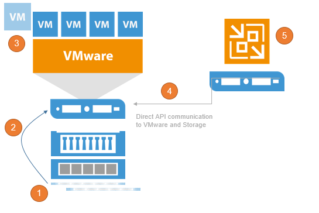

# Veeam Explorers

Veeam Explorers are tools included in all editions for item-level recovery from several application. As of v9, following Explorers are available:

* Veeam Explorer for Active Directory
* Veeam Explorer for SQL Server
* Veeam Explorer for Exchange
* Veeam Explorer for SharePoint
* Veeam Explorer for Oracle
* Veeam Explorer for Storage Snapshots

Each Explorer has a corresponding user guide available in Helpcenter: [Veeam Backup Explorers User Guide](https://helpcenter.veeam.com/backup/explorers/introduction.html). For specifics of performing granular restore of certain applications refer to the Applications section of this guide.

**Note:** Some recommendations for the staging system (if required for Veeam Explorer tool) can be also found in the [Veeam Backup Server](./backup_server_introduction.md) and [Veeam Backup & Replication Database](./backup_server_database.md) sections of this document.

## Explorer for Storage Snapshots
Veeam Explorer for Storage Snapshots (VESS) is included, but it is
related to storage integrations with primary storage. This is explained in
the [Backup from Storage Snapshots](./backup_from_storage_snapshots.md) section
of this guide.

VESS is a very easy way to perform item-level recovery directly from storage
snapshots. Veeam is able to use discover and mount any storage snapshot for
restores. By combining the Veeam application consistent with crash consistent
snapshots, the RPO for certain applications can be significantly reduced.

When opening VESS, the following workflow kicks off:

1.  Creating a Clone of the Snapshot to make it writeable

2.  In case of Block access (iSCSI, FC, FCoE) mount the new LUN to a
    proxy ESXi and register a temporary datastore, in case of NFS access
    the existing NFS datastore and look for the cloned VM

3.  Register the temporary VM within the VMware inventory

4.  Access the VM using the VMware API

5.  Show the content as a Veeam Explorer to restore

After restoring and exiting VESS, the temporary datastore,
VM and LUN clones will be rolled back and cleaned up.
