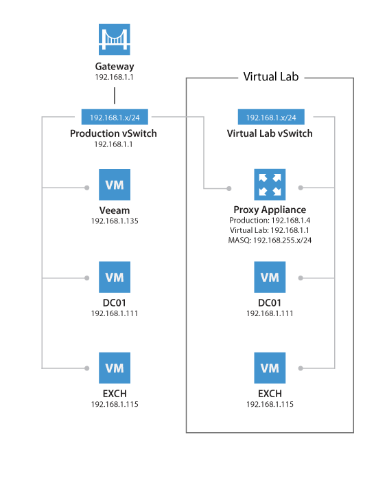
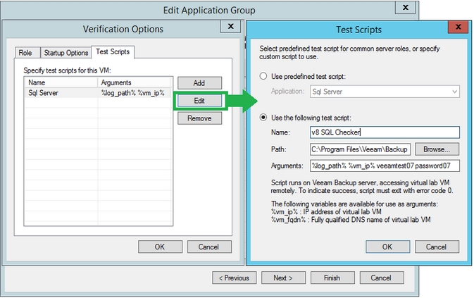

# vPower NFS and Virtual Lab

### Virtual Lab Appliance Overview 

The Virtual Lab appliance operates as a gateway for the layer of network
address translation (NAT) between the Veeam backup server and the
isolated virtual machines in the Virtual Lab . It can also be used to
provide access to other clients in the network, using static mapping. If
VMs running in the isolated network need Internet access, the Virtual
Lab appliance can act as an HTTP proxy server.

While a SureBackup job is running, static routes for the masquerade
networks are automatically added (temporarily) to the routing table on
the Veeam backup server. To review the routing table, open a command
prompt on the Veeam backup server and enter:

route print -4

You may run this command before and after starting the SureBackup job to
compare the differences.

Usually, the routes are added just after the Virtual Lab appliance has
booted and has been initialized by the Veeam backup server. As static
routes are added, this will ensure the Virtual Lab appliance is the
first hop for all packets to the masquerade networks.

**Tip**: To skip extra network configuration, place the backup server
and the Virtual Lab appliance in the same network subnet.

Check Veeam Backup & Replication documentation for configuration
details:

-   <http://www.veeam.com/vmware_vpower_eval_guide_8_pg.pdf>

-   <http://helpcenter.veeam.com/backup/80/vsphere/>

### How SureBackup Job Works

This section describes the processes in a SureBackup job.

First, standard vSwitches and port groups, or port groups on existing
Distributed vSwitches are created during the Virtual Lab creation
wizard; then the process goes as described below.

#### Booting Virtual Lab Appliance 

1.  Virtual Lab appliance configuration file is built and mapped to the
    Virtual Lab appliance as an ISO.

2.  Virtual Lab appliance network interfaces are reconfigured for
    appropriate isolated networks.

3.  The Virtual Lab appliance is powered on.

4.  The SureBackup job waits for IP configuration to be published and
    stabilized through VMware Tools.

5.  A static route for the configured masquerade networks is added
    dynamically to the routing table of the Veeam backup server. Those
    static routes are pointing to the IP address of the Virtual
    Lab appliance.

**Tip:** Earlier versions of Veeam Backup & Replication use VMware
hardware version 4 for the virtual lab appliance. This limits the usable
lab networks to 3. To add more networks/NICs, update Veeam to actual
version and launch the Virtual Lab wizard again; this will re-create the
Virtual Lab VM with the virtual hardware version defined in the VMX
file: *%ProgramFiles%\\Veeam\\Backup and
Replication\\Backup\\LiveCD\\drv\_va.vmx\
*Beginning with Veeam Backup & Replication 8 patch 1, the VMX file was
updated to use virtual hardware v7. Another option is (for older Veeam
versions) to update the Virtual Lab VM by VMware vSphere (Web) client to
at least virtual hardware v7. After upgrading the virtual hardware
version (by Veeam wizard or manually) you can start the wizard again and
create up to 9 virtual lab networks.

#### Booting Virtual Machines 

1.  Veeam publishes and registers VMs using Veeam vPower NFS from the
    repository containing the backup file.

**Note:** If the VMs to be booted in the Virtual Lab in an Application
Group are replicas, this step will be skipped.

2.  Veeam reconfigures the VMs to connect to isolated port groups. If
    any NICs are connected to port groups that are not configured on the
    virtual lab configuration, they will be disconnected automatically.

3.  Veeam creates a snapshot for virtual machine to redirect write
    operations to the production datastore selected during the Virtual
    Lab configuration.

4.  If the domain controller role is selected, registry settings are
    injected to ensure the NETLOGON service will not shutdown due to
    missing peer communication.

5.  VMs are powered on.

6.  During boot, VMware Tools announce IP configuration. The SureBackup
    job waits for this information to stabilize.

**Note:** If VMware Tools are not installed on the virtual machine, the
job will wait for the duration of **Maximum allowed boot time**
configured for such VMs. This will slow down SureBackup jobs
significantly. Therefore, it is always recommended to install VMware
Tools on a verified VM.

2.  VM testing begins (if enabled for the Application Group):

    a.  **VMware Tools heartbeat** is used for verifying that the VM OS
        is successfully started.

    b.  **PING** tests are initiated based on the masquerading
        network configuration. The ping is sent from the Veeam
        backup server. Since the masquerade network is not part of the
        Veeam backup server's own broadcast domain, the packet is sent
        to the first hop matching this network. As the static route to
        the masquerade networking was added after the boot of the
        Virtual Lab appliance, this appliance will act as gateway
        between the two components: Veeam backup server and isolated
        virtual machine.

    c.  **Application-specific testing** using scripts is enabled based
        on the roles assigned to a VM in the application
        group configuration. The built-in roles will check corresponding
        TCP ports for a given service, while additional testing is
        available for the SQL Server (see the next section). TCP
        requests are sent from the Veeam backup server, and the routing
        to the virtual machine is handled by the Virtual Lab
        proxy appliance.

    d.  **CRC verification** is optionally available and is disabled
        by default. If enabled, it will ensure all content of the backup
        file is consistent with the hash values at the time they
        were written. This consistency check is using the CRC algorithm
        for hashing. Warning, this feature will read 100% of the data
        from the backup file.

3.  Once all virtual machines within an application group have been
    successfully booted and verified, VMs from linked jobs may boot.

#### Checking SQL Server Database Availability 

With Veeam Backup & Replication v8, a new Visual Basic script has been
shipped with the product to allow for testing whether all databases on a
given instance are available. This script is available in the Veeam
installation folder as the **Veeam.Backup.SqlChecker.vbs** file.

By default, the script tries to retrieve and check *all* instances (you
can optionally specify the necessary instance). It enumerates all
databases and checks if these databases are available, using the USE
statement.

By default, the script will impersonate the service account under which
the Veeam Backup Service is running (default in v8 is SYSTEM). The
script also accepts two additional parameters to use SQL authentication
instead.

**Important!** To ensure proper authentication and access, it is
required for the said user to have 'public' access to all databases.

The script includes detailed comments that describe the exact behavior.

#### Creating Custom Roles 

Though there are a number of built-in tests intended for
application-level testing, you may need to develop additional scripts
for testing proprietary applications. For that, carry out the following:

1.  Open the Veeam installation folder and look through the *SbRoles*
    folder- all roles are defined in the XML files available in
    this folder.

2.  To create custom roles, duplicate one of the above mentioned files
    and modify the **&lt;Id&gt;** tag using a UUID generator (such as
    <https://www.uuidgenerator.net>). Use this configuration file to
    specify the GUI settings.

When creating custom roles for Linux-based applications, you may need to
execute code locally within the VMs. For that, use **plink.exe** shipped
with the product and located in the *Putty* subfolder of the Veeam
Backup & Replication installation directory.

When executing bash scripts locally on a Linux virtual machine using
**plink.exe**, the exit codes are passed to the SureBackup job, enabling
correct error reporting. If using **plink.exe** in combination with a
SSH private key, you should connect manually (one time) to the VM via
SSH using **putty.exe** to accept the target VM SSH fingerprint
(otherwise, the SureBackup job will wait for this input and ultimately
timeout).

**Note:** You can use **puttygen.exe** to create a private key.

Another option for testing service availability with
*Veeam.Backup.ConnectionTester.exe* is decribed in
<http://www.veeam.com/kb1312>.

#### Troubleshooting Mode 

If you need to troubleshoot Virtual Lab, it is recommended to start
sessions in the Troubleshooting Mode. For that:

1.  Open up **Statistics** for a SureBackup job.

2.  Right-click any VM.

3.  Select **Start**.

The SureBackup lab will now start in the troubleshooting mode, which
means that errors will not cause the Virtual Lab to shut down
immediately.

This opportunity is especially helpful during an implementation phase
while measuring application boot times via vPower NFS, or implementing
custom verification scripts. When you have finished troubleshooting, you
can stop the SureBackup session manually.

**Tip:** ICMP traffic is blocked on all network interfaces of the
Virtual Lab appliance, but you can PING the VMs by masquerade IPs. ICMP
will be fully supported in one of the forthcoming Backup & Replication
versions . See also
<http://forums.veeam.com/veeam-backup-replication-f2/sure-backup-ping-virtual-appliance-gateway-t26850-15.html#p149069>.

Windows servers may change their network and firewall profiles to
"Public". This may lead to application testing scripts not responding to
TCP socket connections.

### Virtual Lab in Complex Environments 

When using standard vSwitches in the VMware vSphere infrastructure, the
Virtual Lab proxy appliance and the isolated networks will run on the
same ESXi host. The reason is that standard vSwitches and their port
groups are bound to one single host. Since the Virtual Lab port groups
are isolated by nature, these should not be known to the core network in
terms of vLAN tagging or routing.

When a distributed vSwitch (dvSwitch) is available, port groups can span
multiple ESXi hosts. Distributed vSwitches are typically required when
using Virtual Lab for replicas (SureReplica), as replicas will often
span multiple hosts (vSphere Distributed Resource Scheduler (DRS) may
also distribute VMs across multiple hosts within a cluster when they are
booted).

**Important!** Please check the following help article and the links at
the bottom of the webpage before you configure Virtual Labs together
with distributed switches:
<http://helpcenter.veeam.com/backup/80/vsphere/index.html?surebackup_advanced_vlab.html>.

Even in the environments where distributed vSwitch is available, make
sure that the Veeam backup server and the Virtual Lab proxy appliance
are placed in the same port group to prevent network packages (sent to
the masquerading IP subnets) from being routed.

Most DR datacenters are configured with separate IP networks to allow
for “active-active” configurations. In such cases, layer 3 (IP) and the
requirement for routing will be introduced to establish communication
between the production site and the DR site. For those scenarios, it is
recommended to deploy a Veeam backup server in the DR site. This will
help to get the Virtual Lab working and ensure correct one-click
failover and failback handling if the production site becomes
unavailable. Alternatively, you can specify an unused network segment so
that it does not overlap with any segment used in production.

